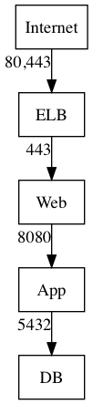

# Firewalls

ansible-provision uses [fireviz](https://www.github.com/moshloop/fireviz) to map and create security groups:

!!! example ""
    **firewall.gv**
    ```graphviz
    digraph G {
        node[shape=rectangle]

        "Internet" -> "ELB" [xlabel="80,443"]
        "ELB" -> "Web" [xlabel="80,443"]
        "App" -> "DB" [xlabel="5432"]
    }
    ```
    to generate an image use: `dot firewall.gv -Tpng -o firewall.png`

    
